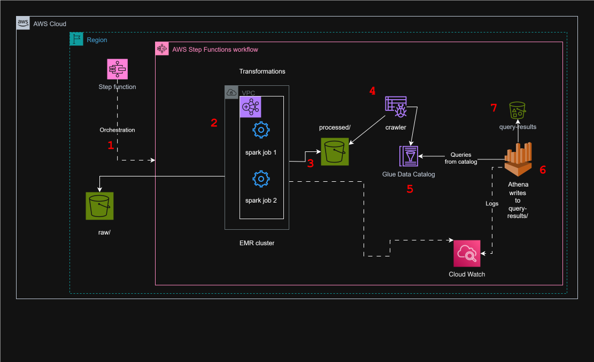

# Car Rental Data Lake Analytics Pipeline

**A scalable, automated big data processing pipeline using AWS EMR, Spark, and serverless analytics services to derive business insights from car rental marketplace data.**

## 📋 Project Overview

This project implements a comprehensive data lake analytics solution for a car rental marketplace, processing large volumes of transactional data to extract key business insights. The pipeline automatically ingests raw CSV data, transforms it using Apache Spark on AWS EMR, catalogs the processed data, and provides automated analytics through Amazon Athena.

### Problems Solved
- **Manual Data Processing**: Eliminates manual ETL processes through full automation
- **Scalability Challenges**: Handles growing data volumes with elastic compute resources
- **Cost Optimization**: Implements transient clusters and serverless analytics to minimize costs
- **Data Silos**: Creates a unified data lake architecture for cross-functional analytics
- **Business Intelligence**: Provides real-time KPIs for location performance, vehicle utilization, and user engagement


## 🏗️ Architecture

### High-Level Architecture



## ✨ Features

- **Automated ETL Pipeline**: End-to-end data processing with AWS Step Functions orchestration
- **Parallel Processing**: Concurrent Spark jobs for optimal performance and cost efficiency
- **Real-time Analytics**: Automated Athena queries for immediate business insights
- **Cost Optimization**: Transient EMR clusters with spot instances and intelligent termination
- **Data Cataloging**: Automatic schema inference and metadata management with AWS Glue
- **Comprehensive Logging**: Detailed monitoring and error tracking throughout the pipeline
- **Modular Design**: Reusable components for easy maintenance and extension
- **Performance Monitoring**: CloudWatch integration for operational visibility


## 🛠️ Tech Stack

### **Infrastructure & Orchestration**
- **AWS EMR**: Managed Hadoop/Spark clusters for distributed processing
- **AWS Step Functions**: Workflow orchestration and automation
- **Amazon S3**: Data lake storage with lifecycle management
- **AWS Glue**: Data cataloging and schema management
- **Amazon Athena**: Serverless SQL analytics engine

### **Data Processing**
- **Apache Spark**: Distributed data processing framework
- **PySpark**: Python API for Spark applications
- **Parquet**: Columnar storage format with Snappy compression

### **Monitoring & Management**
- **Amazon CloudWatch**: Logging and monitoring
- **AWS IAM**: Security and access management
- **Python**: Spark job development and data transformations

### **Development & Deployment**
- **AWS CLI**: Infrastructure management
- **Git**: Version control
- **Markdown**: Documentation

## 🚀 Setup Instructions

### Prerequisites
- AWS Account with appropriate permissions
- AWS CLI configured with credentials
- Basic understanding of AWS services (EMR, S3, Glue, Athena)

### 1. Clone the Repository
```bash
git clone https://github.com/your-username/car-rental-data-pipeline.git
cd car-rental-data-pipeline
```

### 2. Configure AWS Environment
```bash
# Configure AWS CLI
aws configure

# Set your preferred region
export AWS_DEFAULT_REGION=us-east-1
```

### 3. Create S3 Bucket Structure
```bash
# Replace 'your-account-id' with your actual AWS account ID
BUCKET_NAME="car-rental-data-buck1"

# Create main bucket
aws s3 mb s3://$BUCKET_NAME

# Create directory structure
aws s3api put-object --bucket $BUCKET_NAME --key raw/
aws s3api put-object --bucket $BUCKET_NAME --key processed/
aws s3api put-object --bucket $BUCKET_NAME --key scripts/
aws s3api put-object --bucket $BUCKET_NAME --key emr-logs/
aws s3api put-object --bucket $BUCKET_NAME --key athena-results/
```

### 4. Upload Sample Data
```bash
# Upload your CSV files to the raw directory
aws s3 cp vehicles.csv s3://$BUCKET_NAME/raw/
aws s3 cp users.csv s3://$BUCKET_NAME/raw/
aws s3 cp locations.csv s3://$BUCKET_NAME/raw/
aws s3 cp rental_transactions.csv s3://$BUCKET_NAME/raw/
```

### 5. Upload Spark Scripts
```bash
# Upload Spark job scripts
aws s3 cp spark-jobs/vehicle_location_metrics.py s3://$BUCKET_NAME/scripts/
aws s3 cp spark-jobs/user_transaction_analysis.py s3://$BUCKET_NAME/scripts/
```

## 📊 Data Flow / Pipeline Description

### Stage 1: Data Ingestion
- Raw CSV files stored in S3 raw directory
- Four datasets: vehicles, users, locations, rental_transactions
- Data validation and type inference

### Stage 2: Data Processing (Parallel Execution)
**Job 1: Vehicle & Location Performance**
- Calculates revenue per location
- Analyzes vehicle type performance
- Computes utilization metrics
- Generates brand performance insights

**Job 2: User & Transaction Analysis**
- Daily transaction trends
- User engagement metrics
- Hourly usage patterns
- Active vs inactive user analysis

### Stage 3: Data Storage & Cataloging
- Processed data stored in Parquet format with Snappy compression
- AWS Glue Crawler automatically infers schema
- Metadata stored in Glue Data Catalog

### Stage 4: Analytics & Insights
- Automated Athena queries for key business metrics
- Results stored for further analysis
- Integration-ready for BI tools

## 📖 Usage Guide

### Running the Complete Pipeline

1. **Create EMR Default Roles** (First-time setup)
```bash
aws emr create-default-roles
```

2. **Create Glue Database**
```bash
aws glue create-database --database-input Name=car_rental_analytics
```

3. **Create and Execute Step Functions Workflow**
   - Navigate to AWS Step Functions Console
   - Create new state machine using the provided JSON definition
   - Execute with empty input: `{}`
   - Monitor execution progress through visual workflow

### Manual Execution (Alternative)

1. **Create EMR Cluster**
```bash
aws emr create-cluster \
  --name "CarRentalDataProcessing" \
  --release-label emr-6.15.0 \
  --applications Name=Spark Name=Hadoop \
  --instance-type m5.xlarge \
  --instance-count 3 \
  --service-role EMR_DefaultRole \
  --ec2-attributes InstanceProfile=EMR_EC2_DefaultRole
```

2. **Submit Spark Jobs**
```bash
# Get cluster ID from previous command
CLUSTER_ID="j-XXXXXXXXXX"

# Submit parallel jobs
aws emr add-steps --cluster-id $CLUSTER_ID --steps file://spark-steps.json
```

3. **Query Results with Athena**
```sql
-- Example: Top revenue locations
SELECT pickup_location_name, total_revenue, total_transactions 
FROM car_rental_analytics.processed_location_metrics 
ORDER BY total_revenue DESC 
LIMIT 10;
```

## 🚀 Deployment Instructions

### Production Deployment

1. **Environment Configuration**
```bash
# Set production environment variables
export ENVIRONMENT=prod
export BUCKET_NAME=car-rental-data-prod-$(aws sts get-caller-identity --query Account --output text)
```

2. **Create Production Resources**
```bash
# Create production S3 bucket with versioning and encryption
aws s3 mb s3://$BUCKET_NAME
aws s3api put-bucket-versioning --bucket $BUCKET_NAME --versioning-configuration Status=Enabled
aws s3api put-bucket-encryption --bucket $BUCKET_NAME --server-side-encryption-configuration '{
  "Rules": [{"ApplyServerSideEncryptionByDefault": {"SSEAlgorithm": "AES256"}}]
}'
```

3. **Deploy Step Functions Workflow**
```bash
# Create IAM role for Step Functions
aws iam create-role --role-name StepFunctions-CarRentalPipeline-Role --assume-role-policy-document file://trust-policy.json
aws iam attach-role-policy --role-name StepFunctions-CarRentalPipeline-Role --policy-arn arn:aws:iam::aws:policy/AmazonElasticMapReduceFullAccess

# Create Step Functions state machine
aws stepfunctions create-state-machine --name CarRentalDataPipeline --definition file://step-functions-definition.json --role-arn arn:aws:iam::ACCOUNT:role/StepFunctions-CarRentalPipeline-Role
```

### Performance Tests
- Monitor EMR cluster metrics in CloudWatch
- Validate processing times meet SLA requirements
- Check cost optimization targets

## ⚠️ Known Issues / Limitations

### Current Limitations
- **Real-time Processing**: Current implementation is batch-oriented; streaming not supported


### Troubleshooting
- **EMR Cluster Failures**: Check IAM roles and S3 permissions
- **Athena Query Errors**: Verify Glue Catalog table schemas
- **Step Functions Timeouts**: Adjust timeout values for large datasets
- **Cost Overruns**: Monitor spot instance availability and cluster auto-termination

